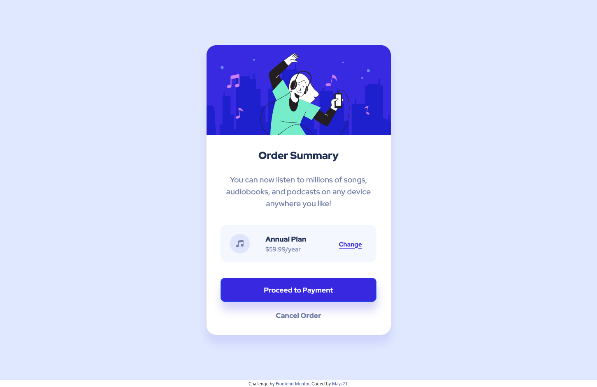

# Frontend Mentor - Order summary card solution

This is a solution to the [Order summary card challenge on Frontend Mentor](https://www.frontendmentor.io/challenges/order-summary-component-QlPmajDUj). Frontend Mentor challenges help you improve your coding skills by building realistic projects.

## Table of contents

- [Overview](#overview)
  - [The challenge](#the-challenge)
  - [Screenshot](#screenshot)
  - [Links](#links)
- [My process](#my-process)
  - [Built with](#built-with)
  - [What I learned](#what-i-learned)
  - [Continued development](#continued-development)
  - [Useful resources](#useful-resources)
- [Author](#author)
- [Acknowledgments](#acknowledgments)

## Overview

### The challenge

Users should be able to:

- See hover states for interactive elements

### Screenshot



### Links

- Solution URL: [https://github.commays21/order-summary-component/](https://github.com/mays21/order-summary-component/)
- Live Site URL: [https://mays21.github.io/order-summary-component/](https://mays21.github.io/order-summary-component/)

## My process

### Built with

- Semantic HTML5 markup
- CSS custom properties
- Flexbox
- CSS Grid
- Mobile-first workflow
- Bootstrap

### What I learned

```css
flex-direction: column;
box-shadow: 2px 20px 20px hsla(245, 75%, 52%, 0.2);

@media screen and (min-width: 960px) {
}
```

### Continued development

- Flexbox
- Media Query

### Useful resources

- [メディアクエリの初心者向けガイド | MDN web docs](https://developer.mozilla.org/ja/docs/Learn/CSS/CSS_layout/Media_queries)
- [flex-direction | MDN plus]

## Author

- Frontend Mentor - [@mays21](https://www.frontendmentor.io/profile/mays21)

## Acknowledgments

- CSS flex-box で縦に並べるには flex-direction: column;を使う
- CSS box-shadow: 2px 20px 20px hsla(245, 75%, 52%, 0.2);
  値 :右、 下、 ぼかし幅、影の色
- Font: Red Hat Display
